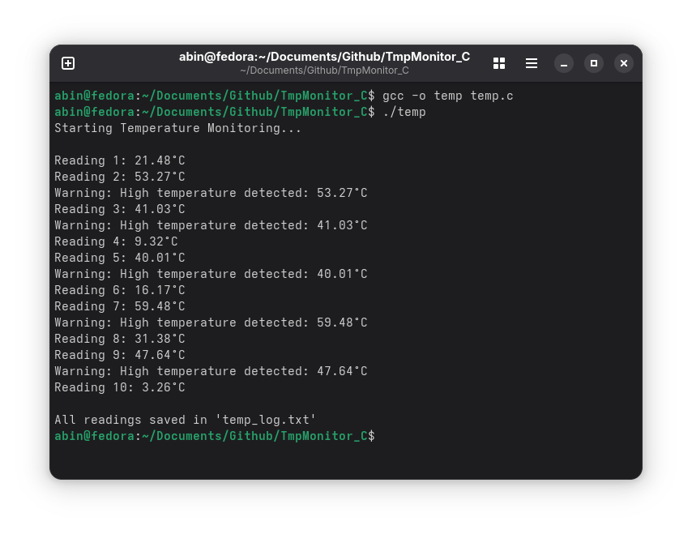

# Simple Temperature Monitor System Using C

This C program simulates a temperature monitoring system.

1. **Constants and Includes:**

   * `NUM_READINGS`: Specifies the number of temperature readings (10 in this case).
   * `TEMP_THRESHOLD`: Defines the temperature threshold (40.0°C) for triggering a warning.
   * `LOG_FILE`: The file where temperature readings will be logged (`temp_log.txt`).

2. **Function Definitions:**

   * `get_temperature()`: Simulates generating a random temperature between 0.00°C and 60.00°C. This is done by generating a random integer between 0 and 6000, then dividing by 100.
   * `check_temperature()`: If the temperature exceeds the `TEMP_THRESHOLD`, it prints a warning message.

3. **Main Function:**

   * Opens a file (`temp_log.txt`) for writing temperature readings.
   * Initializes the random number generator using `srand(time(NULL))`.
   * The program loops `NUM_READINGS` times, generating a random temperature each time.
   * For each reading:

     * Prints the temperature to the console.
     * Checks if the temperature exceeds the threshold and prints a warning if it does.
     * Logs the temperature reading to the file.
     * Pauses for 2 seconds between readings using `sleep(2)`.

4. **File Handling:**

   * The program creates and writes to `temp_log.txt` where it logs each temperature reading.
   * After all readings are taken, the file is closed.

**Code**

**Output**

**Demo Video**

<video width="772" height="580" controls>
  <source src="./assets/tempc.mp4" type="video/mp4">
  Your browser does not support the video tag.
</video>
